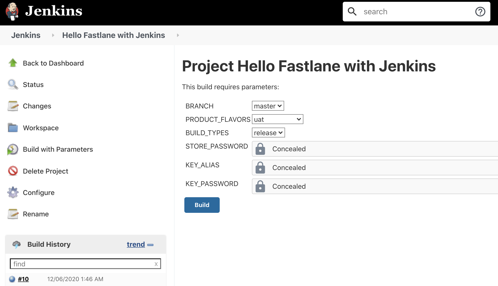
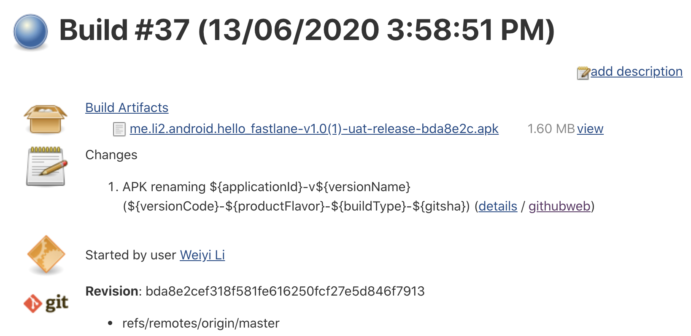
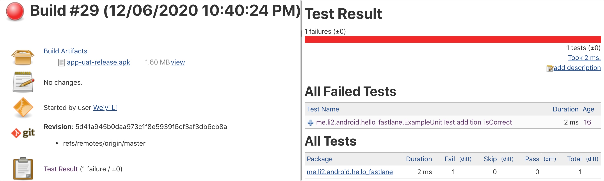

# Hello Fastlane


## Running Android tests using fastlane

Add a test lane in Fastfile:

```ruby
  desc "Runs all the tests"
  lane :test do
    gradle(task: "test")
    gradle(task: "connectedAndroidTest")
  end
```

To use the newly created test lane, just run

`$ fastlane test`

Then you will see the result printed:

```xml
+------+----------------------+-------------+
|             fastlane summary              |
+------+----------------------+-------------+
| Step | Action               | Time (in s) |
+------+----------------------+-------------+
| 1    | default_platform     | 0           |
| 2    | test                 | 3           |
| 3    | connectedAndroidTest | 83          |
+------+----------------------+-------------+
```

Further read:

- `test`:  Run unit tests for all variants.
- `connectedAndroidTest`: Installs and runs instrumentation tests for all flavors on connected devices.

you can run `./gradlew tasks` to get a list of tasks with all build types and flavors. Refer to [Running unit tests with Gradle](https://developer.android.com/studio/test/command-line)

Add androidTest`VariantName` folders where you can add test cases specific to each one of your flavors to fix androidTest failure: 

```xml
useAppContext 
org.junit.ComparisonFailure: expected:<...droid.hello_fastlane[]> but was:<...droid.hello_fastlane[.dev]>
```


## Jenkins

### Install Jenkins
```shell
$ brew update && brew install jenkins
$ jenkins
    http://localhost:8080/
```

### Config Jenkins for Android

Set environment variables of Android and Java: `Dashboard -> Manage Jenkins -> Configure System -> Global properties -> Environment variables`

```xml
ANDROID_HOME=/Users/your_name/Library/Android/sdk
JAVA_HOME=/usr/libexec/java_home
if encounter error: JAVA_HOME is set to an invalid directory: /usr/libexec/java_home
then try this:
JAVA_HOME=/Library/Java/JavaVirtualMachines/jdk-13.0.2.jdk/Contents/Home
```

Create a new job to build Android project: `Dashboard -> New Item`, enter project name and select Freestyle Project style. click on OK button to continue. In the next page, click on `Source Code Management` tab to set up code repository.

Then setup Android build variants in Jenkins. see commit [#1336a7bb](https://github.com/li2/hello_fastlane/commit/1336a7bb82de0f816e06570f2db333e0ce6efc8a) for detail



### APK renaming

```shell
${applicationId}-v${versionName}(${versionCode}-${productFlavor}-${buildType}-${gitsha})
```



### Run Android unit tests and generate reports on jenkins build page

Install `JUnit Plugin` then configure Job to `Add post-build action ▼`:

| Test report XMLs report            | test-results/*.xml | Available on Jenkins build page if failed.                   |
| ---------------------------------- | ------------------ | ------------------------------------------------------------ |
| Health report amplification factor | 1.0                | 1% failing tests scores as 99% health. 5% failing tests scores as 95% health |
| Allow empty results                | True               | There is no test reports if all state (test, build, sign, etc) succeed, check this option can avoid Jenkins shows failure status. |

Then update `build.sh` to add test task and report test results task. Then you can check the test results for failure details which is much more friendly than `Console Output`.



Refer

- [Fastlane Jenkins Integration](https://docs.fastlane.tools/best-practices/continuous-integration/jenkins/)
- [Build by types and sign Android app from Jenkins](https://www.sromku.com/blog/build-android-jenkins-types)
- [Run lint and unit tests of Android builds from Jenkins](https://www.sromku.com/blog/build-android-jenkins-tests-lint)


## Beta Release to Firebase App Distribution

Make sure you have already setup your Firebase project, added your app to firebase project,  onboard your app by pressing the "Get started" button on the App Distribution page.   

Then you can follow the doc to setup Firebase CLI, refer:

- [Distribute Android apps to testers using fastlane](https://firebase.google.com/docs/app-distribution/android/distribute-fastlane), also explains parameters used in `firebase_app_distribution` section in the following code snippet:
- [Fastlane Action: build_android_app](https://docs.fastlane.tools/actions/build_android_app/), also explains parameters used in `gradle` section in the following code snippet:

Add a UAT beta release lane in Fastfile:

```ruby
  desc "Submit a new Beta Build to Firebase App Distribution"
  lane :uat do
    gradle(
      task: "assemble",
      flavor: "Uat",
      build_type: "Release",
      print_command: false,
      properties: {
        "versionCode" => 1,
        "versionName" => "1.0.0",
        "android.injected.signing.store.file" => "keystore.jks",
        "android.injected.signing.store.password" => ENV["STORE_PASSWORD"],
        "android.injected.signing.key.alias" => ENV["KEY_ALIAS"],
        "android.injected.signing.key.password" => ENV["KEY_PASSWORD"],
      }
    )
    firebase_app_distribution(
        app: "1:123456789:android:abcd1234",
        testers: "tester1@company.com, tester2@company.com",
        release_notes: "Lots of amazing new features to test out!",
    )
  end
```

To avoid having private key info hardcoded in Fastfile, you can use environment variables as showed above, refer

- [Fastlane Action: environment_variable](https://docs.fastlane.tools/actions/environment_variable/)
- [Android Continuous Integration using Fastlane and CircleCI 2.0 — Part III](https://medium.com/pink-room-club/android-continuous-integration-using-fastlane-and-circleci-2-0-part-iii-ccdf5b83d8f5)
- [How to add permanent environment variable in zsh](https://apple.stackexchange.com/questions/356441/how-to-add-permanent-environment-variable-in-zsh) Note: Although I use zsh, add the env val to `.bash_profile` works for me, not `.zshenv`

To use the newly created beta release lane, just run

`$ fastlane uat`

which will generate APK, sign it, upload to Firebase App Distribution:

```xml
+------+---------------------------+-------------+
|                fastlane summary                |
+------+---------------------------+-------------+
| Step | Action                    | Time (in s) |
+------+---------------------------+-------------+
| 1    | default_platform          | 0           |
| 2    | assembleuatrelease        | 3           |
| 3    | firebase_app_distribution | 16          |
+------+---------------------------+-------------+

[20:09:18]: fastlane.tools finished successfully 🎉
```


## Deploy to Google Play using fastlane

Preparation

- Creata an Application and upload a bundle build manually to Play Console to avoid error _"No application was found for the given package name"_ in the following supply setup steps.
- [Setting up supply](https://docs.fastlane.tools/getting-started/android/setup/#setting-up-supply) 
    - create a Google Service Account in Google Cloud Console;
    - grant application access for the newly added service account in Play Console;
    - download service account credentials json file from Google Cloud Console;
    - test the connection to Play Console with the json file;
    - init `supply` and download your App metadata from Play;

TODO (stuck on this issue 2020-06-13 22:53:42)

> Google Api Error: Invalid request - Access Not Configured. Google Play Developer API has not been used in project  xxx before or it is disabled.  [fastlane issue #16593](https://github.com/fastlane/fastlane/issues/16593)
